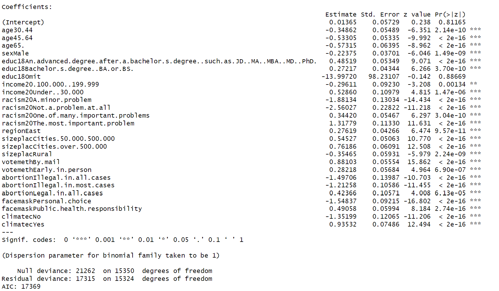

```{r setup, include=FALSE}
knitr::opts_chunk$set(echo = TRUE)
library(tidyverse)
library(glmnet)
```

# Introduction

The 2020 United States Presidential election marked a moment in our nation's history where political awareness and engagement all across the nation seemingly took an all time high. Given the context of the global Covid-19 pandemic where many people were forced to mail in ballots and the death of George Floyd, which sparked a national cry for outrage against systemic racism, the 2020 presidential election took on even greater significance. Many citizens believed that the future of the United States of America solely depended on the outcome of this election. The 2020 United States Presidential election showcased how important every vote can be and as a group we chose to analyze whether or not an individual's vote can be accurately predicted from the available factors. In the end we had two main research questions:

* Who do we predict will win the 2020 presidential election? (popular vote and electoral college)

* Which variables are significant for predicting who a respondent voted for?

We chose the data set, collected by Cornell, National Election Pool Poll: 2020 National Election Day Exit Poll. This data set contains a telephone survey and an election day exit poll. The survey consisted of demographic data, who each participant voted for, and other opinion questions. 

**Table 1:** Variable Definitions

\begin{table}[ht]
\begin{tabular}{p{0.15\linewidth} | p{0.15\linewidth} | p{0.1\linewidth} | p{0.6\linewidth}}
Variable & Variable Name & Data Type & Description \\ \hline
Age & age10 & ordinal & Age group participant is a part of \\ \hline
Sex & sex & nominal & Sex of the voter \\ \hline
Education & educ18 & ordinal & Education level of the participant. \\ \hline
Income & income20 & ordinal & Income bracket of participant. \\ \hline
Racism & racism20 & ordinal & Is racism in the US… (the most important problem, one of many important problems, a minor problem, not a problem at all, omit) \\ \hline
Life & life & ordinal & Describes whether or not the participant has a pessimist/optimist view of the world. \\ \hline
Party & party & nominal & Party affiliation of the participant. \\ \hline
State & statenum & nominal & State where the participant is voting from. \\ \hline
City & sizeplac & ordinal & Size of the city where the participant is living in. \\ \hline
Pres & pres & nominal & Who the participant voted for in the 2020 election. \\ \hline
Weight & weight & continuous & How well the participant represents the population. \\ \hline
2016 vote & vote2016 & nominal & Who the participant voted for in 2016 presidential election \\ \hline
Voting method & votemeth & nominal & Voting method (election day, by mail, or early in-person) \\ \hline
Abortion & abortion & ordinal & Which comes closest to your position? Abortion should be legal in all cases, legal in most cases, illegal in most cases, or illegal in all cases? \\ \hline
Climate change & climatec & nominal & Do you think climate change, also known as global warming, is a serious problem? 

\end{tabular}
\end{table}


# Voting Bootstrap
We first must cover a disclaimer over our use of bootstrap on this data. One of the main bootstrap is that each observation of data has equal chance of occurring. However, this data set is weighted, indicating that each observation has a different chance of occurring. To fix this, under the professor's instructions, we sampled the data the way you would using a bootstrap (meaning each observation is the same) and then applied the weights afterward. This allows us to obtain a more valid estimate using the data, while still conducting bootstrap.

Our initial move was just to do a bootstrap just of the popular vote. We wanted to get a good estimate about the variance of outcomes of the election. Below, we have a histogram with simulated percentage of vote going to Biden on the horizontal axis.

{width=75%}

As is evident, Biden gets a majority of the votes in most of the bootstrap simulations, around eighty percent of them. However, it is not quite a done deal, as there are still twenty percent of the simulations in which Biden does not get the majority of the votes. 

We also conducted a bootstrap of each of the states. We wanted to be able to see whether we could predict the 2020 election using bootstrap. Below, we have a simulated electoral map where blue indicates states in which Biden had over fifty percent of the vote in the majority of the bootstrap simulations. Meanwhile red indicates states where Biden received less than fifty percent of the vote in most of the simulation, implying that Trump is more likely to win.

{width=50%}

This simulation clearly indicates that Biden will win most states. However, this prediction is misguided, as many of the states that Biden wins a majority of the time here he did not in fact win in the actual election. This includes states that are clear Republican strongholds such as Alabama and Idaho, which Biden was not ever going to end up winning in 2020. This is a finding that is evident in real life, as seen in this [NYT article](https://www.nytimes.com/2018/03/29/opinion/2016-exit-polls-election.html), democratic voters are often oversampled in polls which gives a bad representation of the whole country. Thus, we've shown how this is in effect in our analysis.

One final bootstrap we did was a simulation of the popular vote by age. This allows us to get an idea of how each age group will vote, as well as its certainty. Below we have a violin plot, sub grouped by the age bracket of the voter. 

{width=50%}

We can tell that the older a person gets, the less likely they will vote for Biden. As a result, the vast majority of the simulations show voters over 65 years old giving Biden less than 50 percent of the vote, as well as a majority of voters 45-64 years old doing the same. Meanwhile, Biden gets a majority in most of the 30-44 year old simulations and all of the 18-29 year old ones. However, we can also see that the 18-29 age bracket has by far the most variance. This may be due to how younger voters are less likely to respond to polls, meaning they will be underrepresented and thus are estimates of their voting patterns with be less certain.

# Logistic Model

We used logistic regression to predict our binary response: whether a given respondent would vote for Biden or not Biden. We decided to use the following predictors for our initial model: age, sex, education, income, size place, voting method, LGBT, region, racism, abortion, life, climate change, and face mask. The first eight predictors listed are responses to demographic questions and the latter five are responses to opinion questions (see Table 1 for more details).

These predictors were selected because we were interested in whether they would be significant predictors for who a respondent voted for. We excluded obvious variables, such as who they voted for in 2016 and party affiliation, since the main purpose of this model was to see which predictors were significant rather than prediction. 

Since all of our predictors were categorical, we used one-hot encoding to relevel the categories. The following levels were set as the reference:

**Table 2:** One-hot Encoding Reference Levels

\begin{tabular}{c|c}
\hline
  Predictor & Reference level\\
  \hline
  age & 18-29\\
  sex & Female\\
  education & Never attended college\\
  income & Omit\\
  size place & Rural\\
  voting method & Election day\\
  LGBT & Omit\\
  region & South\\
  racism & Omit\\
  abortion & Omit\\
  life & Omit\\
  climate change & Omit
\end{tabular}

```{r, include = FALSE}
cols <- str_split("age
sex
educ18
income20
racism20
life
region
sizeplac
pres
votemeth
abortion
facemask
lgbt
climatec", "\n")[[1]]

data <- read.csv("../Data/31119913_National2020.csv")

data_subset <- data[, cols]

data_subset[data_subset == " "] <- "Omit"

data_subset$age = relevel(factor(data_subset$age), ref = "18-29")
data_subset$sex = relevel(factor(data_subset$sex), ref = "Female")
data_subset$educ18 = relevel(factor(data_subset$educ18), ref = "Never attended college")
data_subset$income20 = relevel(factor(data_subset$income20), ref = "Omit")
data_subset$racism20 = relevel(factor(data_subset$racism20), ref = "Omit")
data_subset$life = relevel(factor(data_subset$life), ref = "Omit")
data_subset$region = relevel(factor(data_subset$region), ref = "South")
data_subset$sizeplac = relevel(factor(data_subset$sizeplac), ref = "Suburbs")
data_subset$votemeth = relevel(factor(data_subset$votemeth), ref = "Election day")
data_subset$abortion = relevel(factor(data_subset$abortion), ref = "Omit")
data_subset$facemask = relevel(factor(data_subset$facemask), ref = "Omit")
data_subset$lgbt = relevel(factor(data_subset$lgbt), ref = "Omit")
data_subset$climatec = relevel(factor(data_subset$climatec), ref = "Omit")

X <- model.matrix(pres ~ ., data_subset)[,-1]
Y <- data_subset$pres == "Joe Biden"

data_full <- data.frame(cbind(Y, X))

mod <- glm(Y ~ ., family = "binomial", data = data_full)
```

## Final Model

After building our initial model, we ran backwards stepwise BIC, which resulted in our final model:

$\hat{\text{president}} = \beta_0 + \beta_1(\text{age}) + \beta_2(\text{sex}) + \beta_3(\text{education}) + \beta_4(\text{income}) + \beta_5(\text{racism}) +$

$\beta_6(\text{size place}) + \beta_7(\text{voting method}) + \beta_8(\text{abortion}) + \beta_9(\text{climate change})$



Each coefficient estimate indicates the change in log odds for voting Biden in comparison with the reference level. As we can see from the model output, at least one level for each predictor was significant at the $\alpha = 0.05$ level. The only predictors omitted from our final model were whether a respondent identified as LGBT, their opinion on face masks, and which region of the US they were from. Note that due to the nature of our predictors, there is likely collinearity.

## Results

Some notable trends our model predicted were:

1. As education level increased, the more likely they were to vote for Biden.

2. The more a respondent considered racism to be a problem, the more likely they were to vote for Biden.

3. If a respondent voted by mail or early in-person, they were more likely to vote for Biden. The positive coefficient associated with voting by mail may have been due to COVID-19 concerns in 2020. The positive coefficients for both levels accurately describe voting behavior in 2020. Early polls tended to overstate Biden's lead in the election (Keeter et al., 2021).

4. Men were less likely to vote for Biden and people who omitted sex, which likely included non-binary individuals, were more likely to vote for Biden.

5. The more a respondent favored the right to abortion, the more likely they were to vote for Biden.

6. If a respondent did not believe in climate change, they were much less likely to vote for Biden.

Trends for other predictors were less clear, but still significant.

## Model Validation

We validated our final model by creating a confusion matrix for our test data.

```{r, echo = FALSE, warning = FALSE, message=FALSE}
train <- readRDS("../data/data_train.RDS")
test <- readRDS("../data/data_test.RDS")

mod_final <- glm(Y_final ~ ., family = "binomial", data = train)

actual <- test$Y_final
predicted <- (predict(mod_final, test, type = "response") > 0.5)*1

# Create a data frame with the actual and predicted labels
data <- data.frame(actual, predicted)

cm_data <- data %>% 
  group_by(actual, predicted) %>% 
  summarize(n = n()) %>% 
  mutate(actual = as.character(actual), predicted = as.character(predicted))

cm_data$actual <- factor(cm_data$actual, levels = c("1", "0"))
cm_data$predicted <- factor(cm_data$predicted, levels = c("0", "1"))
cm_data$labels <- c("True Negatives", "False Positives", "False Negatives", "True Positives")

cm_data <- cm_data %>% 
  mutate(labels = paste0(n, "\n", labels))

# Plot the confusion matrix using ggplot
cm_plot <- cm_data %>% 
  ggplot(aes(x = actual, y = predicted, fill = n)) +
  geom_tile() +
  geom_label(aes(label = labels), color = "black", size = 4, fill = "gray90") +
  scale_fill_gradient(low = "white", high = "#2a3990") +
  scale_x_discrete(labels = c("", "")) +
  scale_y_discrete(labels = c("", "")) +
  labs(title = "Confusion Matrix", 
       x = "", 
       y = "",
       subtitle = paste(
         "Recall: ", round(cm_data[cm_data$actual == "1" & cm_data$predicted == "1",]$n/(cm_data[cm_data$actual == "0" & cm_data$predicted == "1",]$n + cm_data[cm_data$actual == "1" & cm_data$predicted == "1",]$n), 2),
         " | Precision: ", round(cm_data[cm_data$actual == "1" & cm_data$predicted == "1",]$n/(cm_data[cm_data$actual == "1" & cm_data$predicted == "1",]$n + cm_data[cm_data$actual == "1" & cm_data$predicted == "0",]$n), 2),
         " | Accuracy: ", round(sum(cm_data[cm_data$actual == cm_data$predicted,]$n)/sum(cm_data$n), 2))) +
  theme_minimal()
cm_plot
```

As we can see from the confusion matrix, our model performed relatively well. The recall, precision, and accuracy of our model were 0.68, 0.73, and 0.69, respectively. However, recall that the primary purpose of our model was to determine which predictors were significant, rather than obtaining the highest accuracy.

# Bootstrap of Coefficients
After creating our model through the aforementioned model selection process, we wanted to obtain an estimate of the variance of the coefficients. Since bootstrap is a way for us to estimate how much coefficients vary in a model, we decided to conduct a bootstrap on our model. The following chart are violin plots of every coefficient in our model, categorized by question. The colors below indicate whether the median of the coefficient is above or below zero. A blue coefficient means that the median coefficient is above zero, saying that in the majority of simulations responding a question this way means that person is more likely to vote for Biden. Meanwhile, a red coefficient is the reverse.


A few observations can be made from looking at this chart. One is that the intercept seems to be around zero, with slightly more of the simulations being above, which indicates that our reference levels lead to a voter close to the middle of the political spectrum. However, we can see that some of these coefficients are heavily dependent on the set reference level for that question, such as age and vote method, with all of their coefficients being on only one side of zero. 

Other insights from this chart include that the omit response seems to have plenty of variance, especially compared to other responses in the same question. This means that a person omitting answering a question does not tell us much in regards to who they will vote for. We also can see that the climate question has a clear effect, with Yes being completely above zero, and No being completely below zero. Meanwhile, we also can tell that the racism question is similar, with two of the response being clearly above zero and two clearly below zero. Abortion is similar in this respect, but not as extreme, since some of the coefficients appear to cross zero.

# Conclusion

In conclusion, this analysis utilized bootstrap techniques to gain insights into the 2020 election, examining the popular vote, state-level predictions, voting patterns by age, and coefficients in a logistic model. The results shed light on important aspects such as oversampling, variable significance, and the predictive capabilities of the models.

When delving into the results, we discovered that certain variables held more significance than others, as indicated by lower p-values. Particularly noteworthy were the variables related to opinions on "Racism" and "Climate." These variables consistently exhibited strong significance across all categories, suggesting their importance in determining whether an individual voted for Biden. This finding adds validity to our model, highlighting the significance of these factors in real-world voting behavior.

It is worth mentioning that our logistic regression model was primarily developed for interpretation purposes rather than accurate prediction. However, recognizing the practical importance of accurate predictions, we are interested in exploring the application of undersampling techniques. By rectifying the issue of democratic overrepresentation, we aim to improve the reliability of our model and assess how it impacts the results.

Additionally, we plan to test alternative tree-based models in comparison to our regression model. This exploration will provide insights into their predictive performance and allow us to evaluate their effectiveness in capturing the complexities of voter behavior. By broadening our analysis and incorporating these modeling approaches, we strive to develop a more robust predictive model for future elections.

In summary, this analysis not only uncovers key findings about oversampling, variable significance, and the impact of certain factors on voting behavior but also emphasizes our commitment to enhancing the predictive capabilities of our model. Through undersampling techniques and the exploration of alternative models, we aim to refine our understanding of the data and create a more accurate and reliable model for predicting election outcomes.

\newpage

# References
Keeter, Scott, et al. "What 2020’s Election Poll Errors Tell Us About the Accuracy of Issue Polling." Pew Research Center, 1 June 2023, https://www.pewresearch.org/methods/2021/03/02/what-2020s-election-poll-errors-tell-us-about-the-accuracy-of-issue-polling/.

Leonhardt, David. "The Hidden Lessons of the 2016 Election." The New York Times, 19 May 2023, https://www.nytimes.com/2018/03/29/opinion/2016-exit-polls-election.html.

Roper Center for Public Opinion Research. "The New York Times/CBS News Monthly Poll # 1981-10: The GOP and Election '82." Roper Center for Public Opinion Research, 7 May 2023, https://ropercenter.cornell.edu/ipoll/study/31119913.